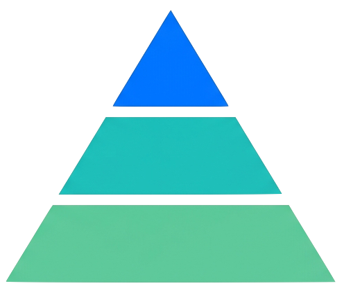

<div align="center">

<br />



# Adaptive Bundle

**Ship 60-90% less JavaScript to devices that can't handle it.**

[](https://www.npmjs.com/package/@adaptive-bundle/core)
[](LICENSE)
[](https://www.typescriptlang.org/)
[](#size-budgets)
[](#architecture)

[Getting Started](#install) · [Why Adaptive?](#why) · [API Reference](docs/configuration.md) · [CLI](docs/cli.md) · [STB/CTV Guide](docs/stb-ctv.md)

</div>

---

### Highlights

- **Zero code changes to start** — install the Vite plugin, get a full bundle analysis report on every build
- **One-line adaptive boundaries** — wrap heavy components, ship lightweight alternatives to low-end devices
- **Build-time intelligence** — chunk isolation guarantees no high-tier code leaks into low-tier bundles
- **< 50ms detection** — hardware scoring with fast-path optimization, cached across sessions
- **~3KB runtime** — zero-dependency core with framework adapters for React, Vue, and Svelte
- **Meta-framework support** — first-class Next.js and Nuxt integrations
- **STB/CTV ready** — the only adaptive loading tool with set-top box and connected TV support
- **100% local** — zero telemetry, zero network calls, GDPR-compatible by design

---

## Why

Modern web apps ship the same JavaScript to every device. A flagship phone with 12GB RAM gets the same 1.2MB bundle as a budget phone with 2GB RAM. On STBs and CTV devices, the problem is even worse.

No production-grade tooling exists for adaptive loading. Google Chrome Labs validated the pattern in 2019 but abandoned it. Adaptive makes it practical.

## Install

```bash
pnpm add -D @adaptive-bundle/vite-plugin
pnpm add @adaptive-bundle/core

# Pick your framework adapter:
pnpm add @adaptive-bundle/react    # React 18+
pnpm add @adaptive-bundle/vue      # Vue 3.3+
pnpm add @adaptive-bundle/svelte   # Svelte 4+
pnpm add @adaptive-bundle/next     # Next.js 13+
pnpm add @adaptive-bundle/nuxt     # Nuxt 3+
```

## Level 0: Plugin Setup (zero code changes)

```ts
// vite.config.ts
import { adaptive } from '@adaptive-bundle/vite-plugin';
import { defineConfig } from 'vite';

export default defineConfig({
  plugins: [adaptive()],
});
```

Build your app -- the plugin outputs a bundle analysis report with heavy dependencies, potential savings, and suggested adaptive boundaries ranked by impact.

## Demo App

A multi-page React dashboard showcasing every adaptive pattern — animated metrics (framer-motion), interactive 3D scene (Three.js), rich markdown editor, canvas charts — all with lightweight low-tier alternatives. See the full difference by adding `?adaptive_tier=low` to any URL.

```bash
cd fixtures/demo-app
pnpm dev   # http://localhost:5173
```

See the **[Demo App README](fixtures/demo-app/README.md)** for architecture details and what each page demonstrates.

## Level 1: Adaptive Boundaries

### Exclusion Pattern

Exclude a heavy component on low-tier devices entirely:

```tsx
import { adaptive } from '@adaptive-bundle/react';

const MapView = adaptive({
  component: () => import('./MapboxMap'),
  lowFallback: ,
  layout: { width: '100%', aspectRatio: '16/9' },
});

<MapView center={[40, -74]} zoom={12} />;
```

### Two-Variant Pattern

Ship different implementations per tier:

```tsx
const Editor = adaptive({
  high: () => import('./RichEditor'),
  low: () => import('./BasicEditor'),
  name: 'editor',
});
```

### Three-Tier Mode

Opt-in per boundary by adding a `medium` variant:

```tsx
const Chart = adaptive({
  high: () => import('./AnimatedChart'),
  medium: () => import('./StaticChart'),
  low: () => import('./ChartTable'),
  thresholds: { high: 0.65, low: 0.35 },
});
```

Score >= 0.65 loads high, < 0.35 loads low, between loads medium.

### Inline Pattern

Conditional rendering within JSX:

```tsx
import { Adaptive } from '@adaptive-bundle/react';

function Dashboard() {
  return (
    <div>
      <Adaptive.High>
        <AnimatedChart data={data} />
      </Adaptive.High>
      <Adaptive.Low>
        <StaticTable data={data} />
      </Adaptive.Low>
    </div>
  );
}
```

### Vue

```vue
<script setup>
import { adaptive } from '@adaptive-bundle/vue';

const MapView = adaptive({
  high: () => import('./MapboxMap.vue'),
  low: () => import('./StaticMap.vue'),
});
</script>

<template>
  <component :is="MapView" :center="[40, -3]" :zoom="12" />
</template>
```

### Svelte

```svelte
<script>
import { adaptive } from '@adaptive-bundle/svelte';

const MapView = adaptive({
  high: () => import('./MapboxMap.svelte'),
  low: () => import('./StaticMap.svelte'),
});
</script>

<svelte:component this={$MapView} center={[40, -3]} zoom={12} />
```

## Hooks, Composables & Stores

### React

```tsx
import { useAdaptive, useTier, useDeviceProfile, useNetworkAware } from '@adaptive-bundle/react';

function MyComponent() {
  const { tier, shouldDefer, profile } = useAdaptive();
  const tier = useTier(); // 'high' | 'low' | 'medium'
  const profile = useDeviceProfile(); // full DeviceProfile
  const { shouldDefer, effectiveType } = useNetworkAware();
}
```

Wrap your app in `AdaptiveProvider` to cache the profile across hooks and prevent re-detection on every hook call:

```tsx
import { AdaptiveProvider } from '@adaptive-bundle/react';

<AdaptiveProvider>
  <App />
</AdaptiveProvider>;
```

### Vue

```ts
import { useAdaptive, useTier, useDeviceProfile, useNetworkAware } from '@adaptive-bundle/vue';

const { tier, shouldDefer, profile } = useAdaptive();
const tier = useTier();
const profile = useDeviceProfile();
const { shouldDefer, effectiveType } = useNetworkAware();
```

### Svelte

```ts
import { tierStore, deviceProfileStore, networkAwareStore } from '@adaptive-bundle/svelte';

$tierStore; // 'high' | 'low' | 'medium'
$deviceProfileStore; // full DeviceProfile
$networkAwareStore; // { shouldDefer, effectiveType }
```

## How Detection Works

The detection engine scores device capability using 5 hardware probes:

| Probe         | Weight | Source                          |
| ------------- | ------ | ------------------------------- |
| CPU cores     | 0.35   | `navigator.hardwareConcurrency` |
| Device memory | 0.35   | `navigator.deviceMemory`        |
| GPU tier      | 0.15   | WebGL renderer string heuristic |
| Screen        | 0.10   | Resolution x device pixel ratio |
| Touch points  | 0.05   | `navigator.maxTouchPoints`      |

The composite score (0-1) determines the tier: >= 0.5 is high, < 0.5 is low. When probes are unavailable (e.g., `deviceMemory` on Firefox), weights redistribute automatically.

A **fast-path** covers ~70% of devices without expensive probing: Data Saver on forces low; cached tier reuses prior result; `deviceMemory` <= 2GB goes low immediately; >= 8GB with 8+ cores goes high immediately. Full scoring runs only for ambiguous devices.

**Asymmetric hysteresis** prevents tier flipping near threshold boundaries: low-to-high requires the score to exceed threshold by 0.12; high-to-low requires falling below by 0.08.

Detection completes in **< 50ms** on any device. Results are cached in localStorage with a 7-day TTL and auto-invalidate when configuration changes.

## Network Awareness

Network conditions are tracked **separately** from hardware tier. A high-end phone on 2G should defer heavy loading:

```tsx
const { shouldDefer, effectiveType } = useNetworkAware();
// shouldDefer: true on 2g/slow-2g
// effectiveType: '4g' | '3g' | '2g' | 'slow-2g'
```

When **Data Saver** is active, the tier is forced to `low` regardless of hardware capability.

## STB/CTV Support

Adaptive is the only adaptive loading tool with first-class STB/CTV support. Three strategies available depending on your build pipeline:

- **`targetTier`** — Build per platform, tree-shake unused variant at compile time. Zero runtime cost. Recommended for per-platform builds.
- **`deviceMap`** — Single build, multiple platforms. Static lookup table bypasses scoring.
- **Custom probe providers** — Feed native platform APIs (Tizen, webOS, Sky) into the scoring engine.

See the full **[STB/CTV Platform Guide](docs/stb-ctv.md)**.

Quick example for per-platform builds:

```ts
adaptive({
  targetTier: process.env.PLATFORM === 'foxtel' ? 'low' : 'high',
});
```

```bash
PLATFORM=foxtel pnpm build   # low-tier-only bundle, no @adaptive-bundle/core
```

## CLI

The plugin ships a CLI for standalone analysis, scaffolding, and validation:

```bash
npx adaptive analyze             # scan source for boundaries
npx adaptive init src/Heavy.tsx  # scaffold adaptive boundary
npx adaptive simulate src/X.tsx  # what-if analysis
npx adaptive report              # regenerate from cached data
npx adaptive validate            # check boundary correctness (CI-friendly)
```

See the full **[CLI Reference](docs/cli.md)**.

## DevTools

### Browser Overlay

```ts
import('@adaptive-bundle/devtools').then((d) => d.init());
```

Shows current tier, score, confidence, all probe values, reasoning chain, per-boundary decisions, and a tier simulator dropdown. Automatically stripped from production builds.

### Dev Server Dashboard

Visit `http://localhost:5173/__adaptive` during development. Shows boundary table with sizes, dependency trees, and a tier simulator with HMR-based live reload.

## Build Reports & Budgets

The plugin generates build reports in three formats:

```ts
adaptive({
  report: true,
  reportFormat: 'console', // default — also 'html' or 'json'
  reportDir: './adaptive-reports',
});
```

- **Console** — boundary summary, sizes, savings, opportunities ranked by impact
- **HTML** — interactive dashboard for stakeholders with trend charts via `history.json`
- **JSON** — structured data for CI pipelines and custom tooling

### Budget Enforcement

Fail or warn the build when bundles exceed size targets:

```ts
adaptive({
  budget: {
    maxLowTierBundle: 150_000, // max bytes for low-tier total
    maxHighVariant: 80_000, // max bytes per high variant
    minSavingsPercent: 10, // minimum savings to justify a boundary
    enforce: 'error', // 'error' fails build, 'warn' logs only
  },
});
```

## Error Recovery

Boundaries automatically retry failed imports after 1 second. If a high-tier variant fails to load, the low variant is loaded as fallback. The `onError` callback lets you hook into error tracking:

```tsx
adaptive({
  high: () => import('./RichEditor'),
  low: () => import('./BasicEditor'),
  onError: (error, boundaryName) => analytics.track('adaptive_error', { error, boundaryName }),
});
```

## Configuration

Basic setup works out of the box. For full options — scoring weights, thresholds, hysteresis, caching, network behavior, SSR defaults, and more — see the **[Configuration Reference](docs/configuration.md)**.

## Server-Side Detection

Resolve tier from Client Hints headers to avoid the 50ms client-side detection cost entirely:

```ts
import { resolveTierFromHeaders } from '@adaptive-bundle/core/server';

// Express / any Node.js server
app.use((req, res, next) => {
  const tier = resolveTierFromHeaders(req.headers);
  // Uses Sec-CH-Device-Memory and Sec-CH-UA-Mobile headers
});
```

Works in any JS server environment including edge runtimes (Cloudflare Workers, Vercel Edge Functions, Deno Deploy). Zero DOM dependencies.

## Testing

```ts
import { setForcedTier, clearForcedTier } from '@adaptive-bundle/core/testing';

beforeEach(() => setForcedTier('low'));
afterEach(() => clearForcedTier());
```

Or via URL parameter: `?adaptive_tier=low`

Use `npx adaptive validate` in CI to check boundary correctness.

## Next.js

```ts
// next.config.js
const { withAdaptive } = require('@adaptive-bundle/next');

module.exports = withAdaptive({
  adaptive: {
    report: true,
    reportFormat: 'console',
  },
});
```

The Webpack plugin runs analysis at build time (production only, client-side) using the same analysis engine as the Vite plugin. It creates `splitChunks.cacheGroups` to isolate tier-specific code.

## Nuxt

```ts
// nuxt.config.ts
export default defineNuxtConfig({
  modules: ['@adaptive-bundle/nuxt'],
  adaptive: {
    report: true,
    clientHints: true, // auto-injects Nitro middleware for Client Hints
  },
});
```

The Nuxt module auto-injects the Vite plugin and registers Nitro server middleware that resolves device tier from Client Hints headers and sets an `adaptive_tier_hint` cookie.

## Privacy

Adaptive is **100% local, zero-telemetry, zero-network**. No data ever leaves the user's device or build environment. This is a hard architectural constraint, not a configurable option. Detection uses only local browser APIs (`navigator.hardwareConcurrency`, `navigator.deviceMemory`, WebGL). Cached data lives in `localStorage` (or memory-only for strict consent policies via `cacheStorage: 'memory'`). Compatible with GDPR, ePrivacy, and operator-specific STB/CTV privacy requirements.

## Architecture

```
packages/
  core/          @adaptive-bundle/core           Detection + scoring (~3KB gzipped, zero deps)
  vite-plugin/   @adaptive-bundle/vite-plugin    Build analysis, chunk splitting, CLI, reports
  react/         @adaptive-bundle/react          adaptive() + hooks + Adaptive.High/Low
  vue/           @adaptive-bundle/vue            adaptive() + composables + AdaptiveHigh/Low
  svelte/        @adaptive-bundle/svelte         adaptive() + stores + context
  next/          @adaptive-bundle/next           Next.js Webpack plugin (reuses vite-plugin analysis)
  nuxt/          @adaptive-bundle/nuxt           Nuxt module + Nitro middleware
  devtools/      @adaptive-bundle/devtools       Browser overlay + dev dashboard
```

Chunk isolation guarantee: **no code from the high variant leaks into the low-tier bundle**. Exclusive dependencies are isolated into separate chunks. Shared dependencies stay in common chunks without duplication.

## Development

```bash
pnpm install
pnpm build
pnpm test
pnpm typecheck
pnpm lint
```

## Size Budgets

| Package                   | Budget        | Enforced     |
| ------------------------- | ------------- | ------------ |
| `@adaptive-bundle/core`   | 3KB gzipped   | CI blocks PR |
| `@adaptive-bundle/react`  | 2KB gzipped   | CI blocks PR |
| `@adaptive-bundle/vue`    | 2KB gzipped   | CI blocks PR |
| `@adaptive-bundle/svelte` | 1.5KB gzipped | CI blocks PR |

---

## License

MIT

<div align="center">
<sub>Built for the devices your users actually have.</sub>
</div>
